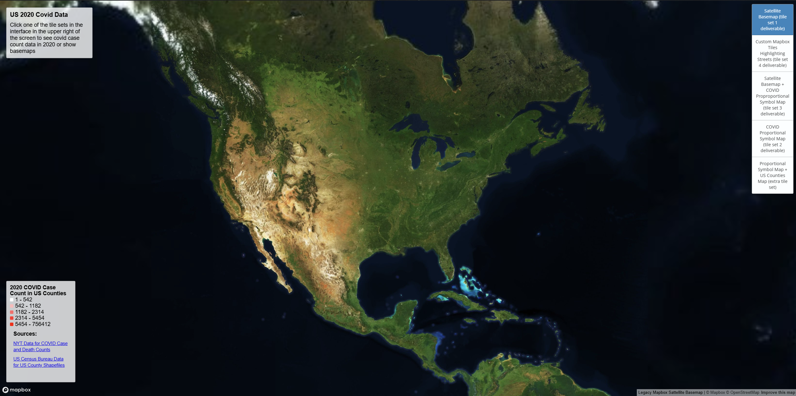
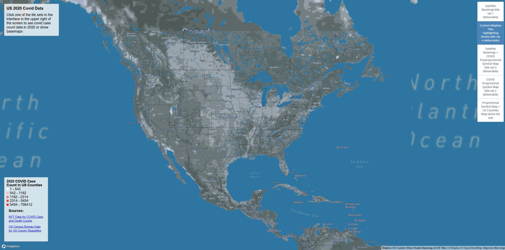
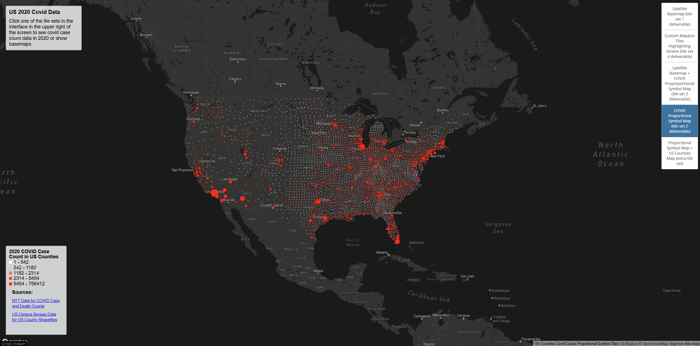
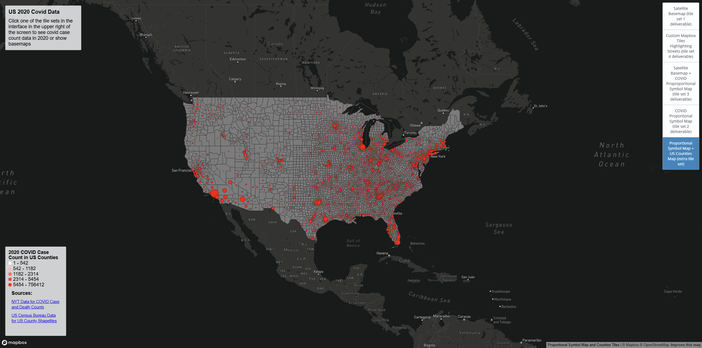

# covid-counts-map-tiles
Lilian Law

geog 458 lab 4 covid counts map tiles

---
### **AI Disclosure**
No AI tools were used in this assignment.

---
### **Introduction**
The following maps and map tile sets are an exploration of creating map tile sets and finding and using data to create map tilesets with the assistance of QGIS and the extension QMetaTiles within QGIS. Mapbox was used for creating map tile templates before importing them into QGIS and using QMetaTiles to export the tile sets for use within the interactive web interface. 

---
### **Web Map Link**
Link to web map and map tiles: (https://liliml.github.io/covid-counts-map-tiles/)[https://liliml.github.io/covid-counts-map-tiles/]

---
### **Additional Information About the Maps and Map Tile Sets and Choices Made When Creating the Tile Sets and Basemaps**
- **Map Area Coverage:** These maps and map tiles focus on the United States and the US counties.
- **Data Choices:** The data used for this project was 2020 Covid case and death counts from the NYT and US county boundary shapefile from the US census bureau to create the grey US counties outline. 
- **Data Sources:**
    - Source for COVID cases/death counts for 2020 are from NYT (used for tile set 3 deliverable, tile set 2 deliverable, and tile set 5 extra tile set): (https://github.com/nytimes/covid-19-data/blob/43d32dde2f87bd4dafbb7d23f5d9e878124018b8/live)[https://github.com/nytimes/covid-19-data/blob/43d32dde2f87bd4dafbb7d23f5d9e878124018b8/live]
    - US county boundary shapefile from the US census bureau useed to create the grey US counties outline (used in tile set 3 deliverable and tile set 5 extra tile set): (https://www.census.gov/geographies/mapping-files/time-series/geo/carto-boundary-file.html)[https://www.census.gov/geographies/mapping-files/time-series/geo/carto-boundary-file.html]
- **Zoom Level:** Each of the tile sets in this project go from a zoom of 0 to 6 as a zoom larger then 6 resulted in greater loading times
both to create the tiles for export and when using the tiles due to the map area coverage being a large area (the US). Additionally, a greater
zoom level then what was chosen for this project would not help convey more detail or tell a better story from the map as the covid case counts 
shown in the proportional symbol map are at the county level, not city or neighborhood level.   
- **Reason for Extra Map Tile Set:** While the proportional symbol map tiles of Covid case counts in 2020 still shows the case counts well, I thought it was harder to see where counties were. As a result I chose to include this extra tile set that had the covid cases proportional symbol map tiles overlaid on a grey US counties shapefile to show where the counties were. The downside to this map tile set is that the counties are not labeled, and as a result the person viewing the the map either needs to know their geography or reference another map of US counties to view the name of the county. However the covid proportional symbol map tile set layer also has a similar problem but in addition to the two solutions I described, the viewer also can zoom into the basemap without the seatllite basemap or custom mapbox tiles layers toggled on to see areas around the county the data point is on to potentially remember the name of the county via viewing the geography of the areas near, around, or within the county (city names are shown such as Seattle).
- **Additional Notes:** The tile sets and maps are not shown in the the exact order of deliverable 1, 2, 3, 3 as shown in the section below and on the web interface as to have the layering show correctly and have the Covid proportional symbol map tile sets appear above the two base maps (Satellite Basemap deliverable 1 and Custom Mapbox Tiles deliverable 4) when selected, the layering had to be shown in this order. Additionally, the proportional symbol map legend classifications (increment levels on the legend) are not ideal, but even after attemting to create custom ones QGIS defaulted to the ones shown on the web interface. The same also applies for the color scheme used on the legend as the colors had to be estimated as when creating the proportional symbol map in QGIS, the exact rgb values for each classification level were not provided, and within the code since the javascript code was not pulling from exact data, I had to hardcode in the values of the classifications. If the project was to edited or polished these issues would be resolved.   

---
### **About the Maps and Map Tile Sets and Screenshots**
***Satellite Basemap (tile set 1 deliverable):***

This map is of the United States and is a satellite view. The source for this data is from mapbox legacy themes: 
(https://docs.mapbox.com/api/maps/styles/)[https://docs.mapbox.com/api/maps/styles/] 
The available zoom levels for this map are from 0 to 6. Any larger resulted in longer loading times
both to create the tiles for export and when using the tiles. A screenshot of this basemap can be seen below.

***Custom Mapbox Tiles Highlighting Streets (tile set 4 deliverable):***

This Mapbox tileset is of the United States, and used the Mapbox navigation night legacy theme: (https://docs.mapbox.com/api/maps/styles/)[https://docs.mapbox.com/api/maps/styles/]. I then customized the coloring of the map, including making the color of the water appear clearer with a more vibrant bright blue color, making the national parks appear in green to show them easier, as well as highlighting major interstates in yellow. The reason I changed the colors of these features in particular was to see if there was any correlation or similarties in where the larger COVID case counts on the proportional symbol maps were relative to where the interstates were. I wanted to ask the question of if more of the cases were closer to major interstates as there is heavy traffic in those areas. A similar question I had was for national parks, even if not able to be seen due to the small zoom levels, as I wanted to see if there was lower levels of Covid in those areas. While it is hard to draw these conclusion due to the proportional symbol map tile data points being at the center of each county meaning the cases could have occured anywhere in that county, these questions could be interesting and potential topics to look into with more data. The available zoom levels for this map are from 0 to 6. Any larger resulted in longer loading times
both to create the tiles for export and when using the tiles. A screenshot of this map tile set can be seen below.  

***Satellite Basemap + COVID Proportional Symbol Map (tile set 3 deliverable):***

This basemap is of the United States, and uses the Satellite Basemap (deliverable 1), with a grey shapefile of the US counties overlaid with a proportional symbol map of COVID cases in 2020 in each US county overlaid on it. The available zoom levels for this map are from 0 to 6. Any larger resulted in longer loading times both to create the tiles for export and when using the tiles. A screenshot of this map tile set can be seen below.  

***COVID Proportional Symbol Map (tile set 2 deliverable):***

This tile set is a proportional symbol map tile set of COVID cases within each US county in 2020, with a white to red color map, with lighter colors and smaller circles in the classification scheme meaning a lower number of COVID cases in that county while larger circles and darker red colors signifiying a higher amount of COVID cases in that county. The available zoom levels for this map are from 0 to 6. Any larger resulted in longer loading times both to create the tiles for export and when using the tiles. A screenshot of this map tile set can be seen below. 

***Proportional Symbol Map + US Counties Map (extra tile set):***

This tile set has a US counties shapefile shown in grey overlaid with a proportional symbol map tile set of COVID cases within each US county in 2020, with a white to red color map, with lighter colors and smaller circles in the classification scheme meaning a lower number of COVID cases in that county while larger circles and darker red colors signifiying a higher amount of COVID cases in that county. The available zoom levels for this map are from 0 to 6. Any larger resulted in longer loading times both to create the tiles for export and when using the tiles. A screenshot of this map tile set can be seen below. 

---
### **References**
- Source referenced to create a proportional symbol map in QGIS: (https://learn-sims.org/geospatial/creating-a-proportional-circle-map-in-qgis/?amp=1)[https://learn-sims.org/geospatial/creating-a-proportional-circle-map-in-qgis/?amp=1]